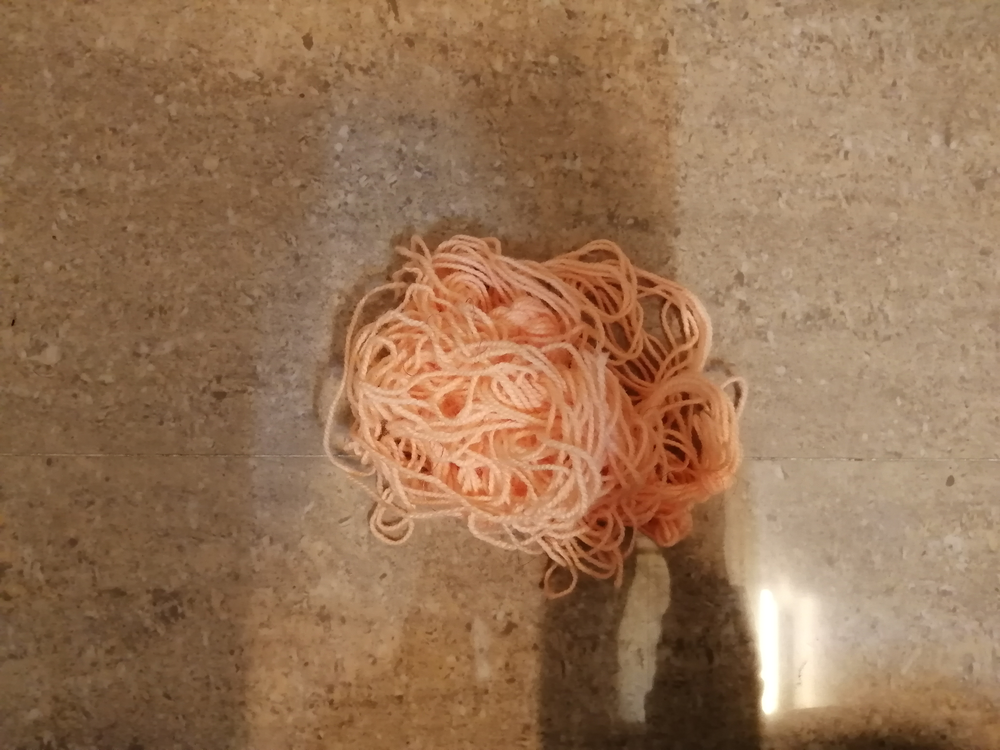
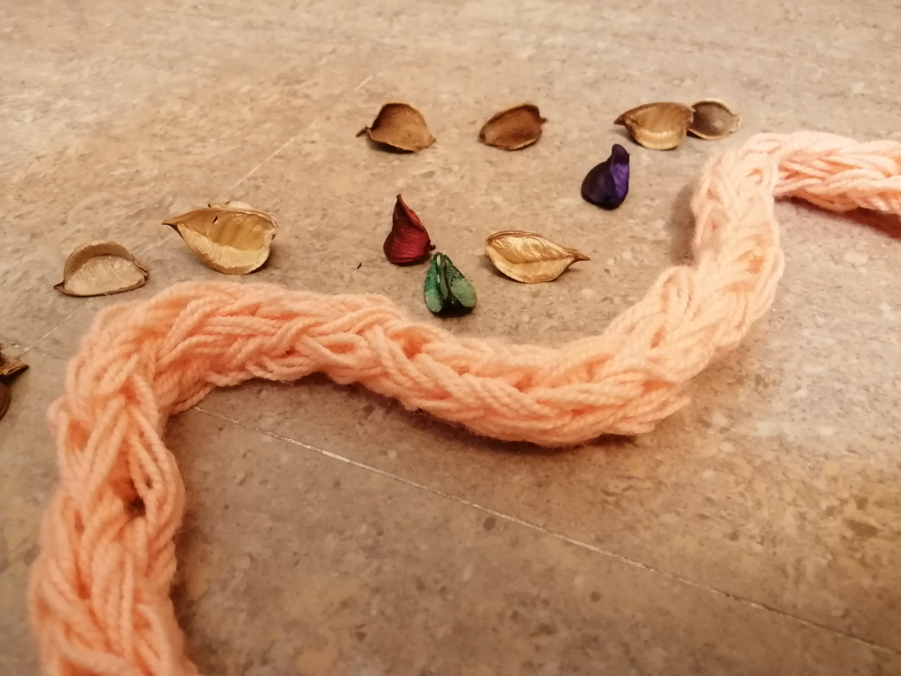
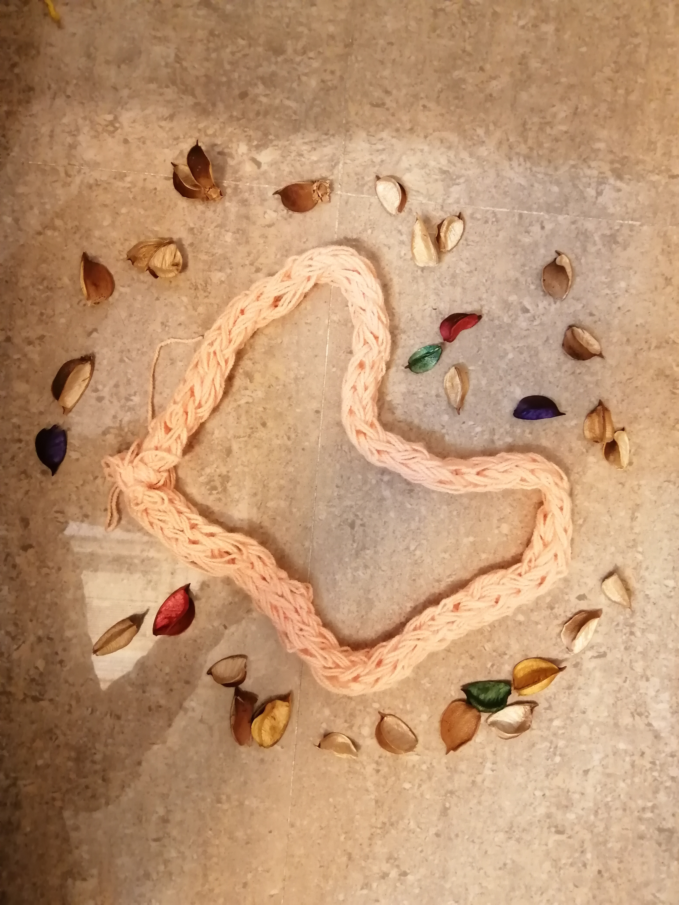

## دست سازه ای با انگشت:

## .یک کاموا با رنگ مورد علاقه انتخاب کنید

## .کاموا را دور چهار انگشت بپیچید و به تریبی که شروع کردید ادامه دهید تا ضخامت آن بیش تر شود

## .شال گردن شما آماده ی استفاده است، از سرما لذت ببرید

