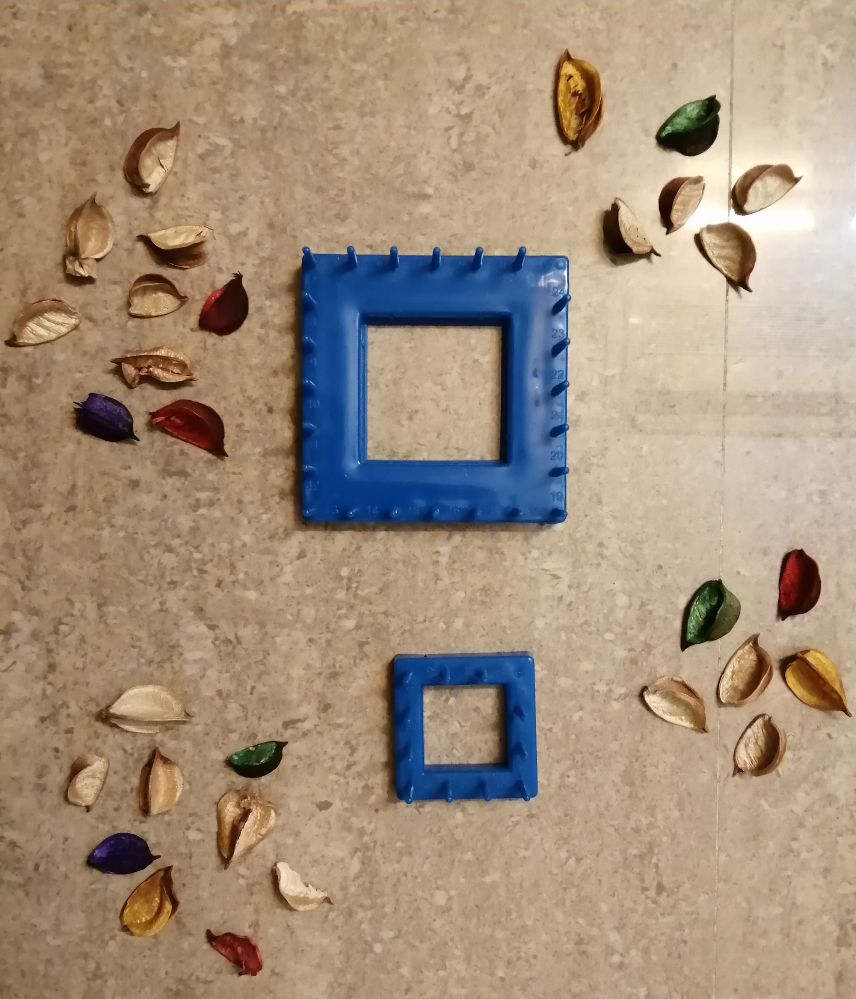

## دست سازه ای از جنس کاموا: 

## .وسیله ای پلاستیکی را مطابق شکل بالا تهیه می کنیم
---

## .دو قسمت را مطابق شکل داخل هم قرار می دهیم
---

## .مقداری کاموا به دلخواه تهیه می کنیم
---

## .از گوشه شروع می کنیم و برای اینکه کاموا باز نشود سر آن را به یکی از چهار گوشه گره میزنیم
---

## مطابق شکل و با توجه به اعداد کاموا را از قسمت گره زده به شماره

**Test**: This is atest
